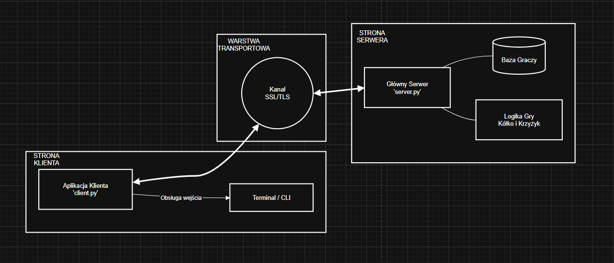

# Dokumentacja Techniczna Projektu: Aplikacja Kółko i Krzyżyk
## Etap 2 — Projekt Aplikacji

**Protokół:** TicTacToe Protocol

**Data:** Kwiecień 2026

**Autorzy:**
* Michał Antosiewicz (151401)
* Michał Ciesielczyk (151412)

---

## Spis treści

1. [Opis funkcjonalny aplikacji](#1-opis-funkcjonalny-aplikacji)
2. [Architektura rozwiązania](#2-architektura-rozwiązania)
3. [Przypadki użycia](#3-przypadki-użycia)
4. [Mapowanie aplikacji na protokół](#4-mapowanie-aplikacji-na-protokół)
5. [Wymagania niefunkcjonalne](#5-wymagania-niefunkcjonalne)
6. [Plan implementacji i testowania](#6-plan-implementacji-i-testowania)

---

## 1. Opis funkcjonalny aplikacji

### 1.1 Co aplikacja robi?

Aplikacja umożliwia dwóm graczom rozgrywkę w kółko i krzyżyk przez sieć w czasie rzeczywistym. Składa się z serwera centralnego oraz klientów terminalowych (CLI). Gracz uruchamia klienta, loguje się na swoje konto, trafia do poczekalni, a gdy znajdzie się rywal — gra rozpoczyna się automatycznie. Plansza 3×3 wyświetlana jest w terminalu po każdym ruchu, a serwer rozstrzyga wynik.

### 1.2 Jaki problem użytkownika rozwiązuje?

Aplikacja rozwiązuje następujące problemy:

**Uczciwa rozgrywka zdalna** — bez wspólnego fizycznego miejsca. Walidacja ruchów odbywa się wyłącznie po stronie serwera, co uniemożliwia oszustwo przez modyfikację danych po stronie klienta.

**Automatyczne znajdowanie przeciwnika** — gracz nie musi znać adresu IP rywala ani ręcznie tworzyć sesji. Mechanizm poczekalni (matchmaking) łączy dwóch oczekujących graczy automatycznie.

**Bezpieczeństwo sesji** — połączenie szyfrowane jest przez TLS, a każda wiadomość podpisana HMAC-SHA256, co uniemożliwia podsłuchanie lub modyfikację danych w trakcie transmisji.

**Obsługa awarii sieciowych** — przy utracie połączenia przez jednego gracza serwer automatycznie przyznaje wygraną drugiemu i informuje go o tym.

### 1.3 Aktorzy

| Aktor | Opis |
|---|---|
| **Gracz** | Zarejestrowany użytkownik, który łączy się z serwerem, loguje i uczestniczy w rozgrywce. Jedyna rola po stronie klienta. |
| **Serwer** | Centralny arbiter — zarządza sesjami, weryfikuje tożsamość, waliduje ruchy, rozstrzyga wynik. Nie jest obsługiwany przez człowieka w trakcie działania. |

---

## 2. Architektura rozwiązania

### 2.1 Model: klient–serwer

Aplikacja działa w modelu klient–serwer z centralnym serwerem jako jedynym źródłem prawdy. Klienci nie komunikują się ze sobą bezpośrednio — wszystkie wiadomości przechodzą przez serwer.

### 2.2 Komponenty

Diagram komponentów

**Klient (`client.py`)** — aplikacja terminalowa (CLI) uruchamiana przez gracza. Odpowiada za: interfejs użytkownika (wyświetlanie planszy, pobieranie ruchów), nawiązanie połączenia TLS, obsługę protokołu TKTP (wysyłanie i odbieranie wiadomości), wątek keep-alive (PING co 10 sekund).

**Serwer (`server.py`)** — centralny węzeł obsługujący wiele połączeń jednocześnie dzięki wielowątkowości. Odpowiada za: przyjmowanie połączeń TLS, autoryzację graczy, zarządzanie poczekalnią (matchmaking), prowadzenie logiki gry (walidacja ruchów, wykrywanie wygranej/remisu), obsługę awarii połączeń.

**Moduł protokołu (`protocol.py`)** — współdzielony przez klienta i serwer. Odpowiada za: budowanie i parsowanie wiadomości JSON, obliczanie i weryfikację HMAC-SHA256, wysyłanie i odbieranie przez socket (z obsługą fragmentacji TCP), definicję wszystkich typów komunikatów i stałych.

**Moduł autoryzacji** — zaimplementowany wewnątrz `server.py`. Przechowuje mapę login → SHA-256(hasło) i weryfikuje dane podczas fazy AUTH. W obecnej wersji dane są zakodowane statycznie; w wersji produkcyjnej zastąpiłaby je baza danych.

**Certyfikat TLS** — pliki `server.crt` i `server.key` generowane przez `openssl`. Zapewniają szyfrowanie całego kanału komunikacyjnego.

### 2.3 Architektura — opis wdrożenia

Serwer uruchamiany jest na jednej maszynie i nasłuchuje na porcie 5555. Klienci uruchamiani są na dowolnych maszynach w tej samej sieci. Każde połączenie klienta obsługiwane jest w osobnym wątku systemowym. Każda para graczy otrzymuje osobny wątek gry — równoległe rozgrywki nie blokują się nawzajem.

Przepływ połączenia od strony serwera: gniazdo TCP przyjmuje połączenie, następuje TLS handshake (wrap_socket), wątek autoryzacji weryfikuje gracza, gracz trafia do poczekalni (chronionej przez threading.Lock), przy znalezieniu pary uruchamiany jest wątek gry obsługujący obu graczy przez select().

### 2.4 Przepływ danych między komponentami

Gracz wpisuje ruch w terminalu. Klient (`client.py`) buduje wiadomość `MSG_MOVE` w module protokołu (`protocol.py`), który oblicza HMAC i serializuje do JSON. Dane przesyłane są przez szyfrowany kanał TLS/TCP do serwera. Serwer odbiera przez `protocol.py` (deserializacja, weryfikacja HMAC), waliduje ruch w logice gry (`server.py`), aktualizuje planszę i buduje `MSG_BOARD`. Odpowiedź wędruje z powrotem przez `protocol.py` → TLS/TCP → `protocol.py` klienta → wyświetlenie planszy w terminalu.

---

## 3. Przypadki użycia

### UC-01: Logowanie do systemu

**Cel:** Gracz uwierzytelnia się i uzyskuje dostęp do poczekalni.

**Aktor:** Gracz

**Warunki wstępne:** Serwer jest uruchomiony. Gracz posiada konto (login i hasło). Pliki certyfikatu TLS (`server.crt`, `server.key`) istnieją po stronie serwera.

**Scenariusz główny:**
1. Gracz uruchamia `python client.py` i wpisuje login.
2. Klient nawiązuje połączenie TCP z serwerem i przeprowadza TLS handshake.
3. Klient wysyła `MSG_HELLO` z loginem.
4. Serwer odpowiada `MSG_HELLO` z powitaniem.
5. Gracz wpisuje hasło. Klient wysyła `MSG_AUTH` z loginem i hasłem.
6. Serwer weryfikuje SHA-256(hasło) z bazą, odpowiada `MSG_AUTH_OK`.
7. Gracz trafia do poczekalni.

**Scenariusze alternatywne / błędy:**
- Błędne hasło: serwer odpowiada `MSG_AUTH_ERR` z liczbą pozostałych prób. Gracz może spróbować ponownie (max 3 razy).
- Wyczerpanie prób: serwer wysyła `MSG_BYE` i zamyka połączenie.
- Serwer niedostępny: klient wypisuje błąd połączenia i kończy działanie.
- Gracz już zalogowany w poczekalni: serwer odpowiada `MSG_ERROR(409)` i zamyka połączenie.

**Wynik końcowy:** Gracz jest zalogowany i oczekuje na rywala w poczekalni.

---

### UC-02: Oczekiwanie na przeciwnika (matchmaking)

**Cel:** System automatycznie łączy dwóch oczekujących graczy w parę i rozpoczyna grę.

**Aktor:** Gracz (dwóch niezależnych graczy)

**Warunki wstępne:** Co najmniej jeden gracz jest już zalogowany i czeka w poczekalni.

**Scenariusz główny:**
1. Gracz A jest już w poczekalni — otrzymał `MSG_WAIT`.
2. Gracz B loguje się pomyślnie.
3. Serwer wykrywa parę (poczekalnia ma ≥ 2 graczy), pobiera pierwszych dwóch.
4. Serwer uruchamia nowy wątek gry dla tej pary.
5. Serwer wysyła `MSG_START` do Gracza A (symbol X, zaczynasz: true) i do Gracza B (symbol O, zaczynasz: false).
6. Serwer wysyła `MSG_YOUR_TURN` do Gracza A.

**Scenariusze alternatywne / błędy:**
- Gracz A rozłącza się w trakcie oczekiwania: serwer usuwa go z poczekalni, slot zostaje zwolniony dla następnego gracza.
- Tylko jeden gracz w poczekalni: serwer cyklicznie utrzymuje połączenie przez mechanizm PING/PONG; gracz czeka bez limitu czasu.

**Wynik końcowy:** Obaj gracze otrzymują `MSG_START` z przydzielonymi symbolami. Gra jest aktywna.

---

### UC-03: Wykonanie ruchu

**Cel:** Gracz, którego jest tura, umieszcza swój symbol na wybranym polu planszy.

**Aktor:** Gracz (aktywny — ten, którego jest tura)

**Warunki wstępne:** Gra jest aktywna. Gracz otrzymał `MSG_YOUR_TURN`. Pole docelowe istnieje w zakresie 0–2.

**Scenariusz główny:**
1. Gracz wpisuje współrzędne `wiersz kolumna` (np. `1 2`).
2. Klient wysyła `MSG_MOVE` z polami `row` i `col`.
3. Serwer weryfikuje: czy to tura tego gracza, czy współrzędne są w zakresie, czy pole jest wolne.
4. Serwer umieszcza symbol na planszy.
5. Serwer wysyła `MSG_BOARD` z nowym stanem planszy do obu graczy.
6. Serwer sprawdza warunek wygranej i remisu — brak → zmiana tury.
7. Serwer wysyła `MSG_YOUR_TURN` do drugiego gracza.

**Scenariusze alternatywne / błędy:**
- Pole zajęte: serwer odpowiada `MSG_ERROR(409)` i ponownie wysyła `MSG_YOUR_TURN` do tego samego gracza. Gracz próbuje ponownie.
- Współrzędne poza zakresem (np. `3 0`): serwer odpowiada `MSG_ERROR(422)` i ponownie wysyła `MSG_YOUR_TURN`.
- Ruch poza kolejnością: serwer odpowiada `MSG_ERROR(403)`. Tura nie ulega zmianie.
- Gracz wpisuje `q`: klient wysyła `MSG_BYE`, serwer przyznaje wygraną rywalowi.

**Wynik końcowy:** Symbol gracza pojawia się na planszy. Tura przechodzi do rywala lub gra się kończy.

---

### UC-04: Zakończenie gry — wygrana

**Cel:** System wykrywa stan wygranej i informuje obu graczy o wyniku.

**Aktor:** Serwer (automatycznie po każdym ruchu)

**Warunki wstępne:** Gra jest aktywna. Ostatni ruch tworzył trzy symbole w linii (wiersz, kolumna lub przekątna).

**Scenariusz główny:**
1. Serwer po przyjęciu `MSG_MOVE` sprawdza wszystkie 8 możliwych linii.
2. Wykrywa trzy identyczne symbole w jednej linii.
3. Wysyła `MSG_WIN` do obu graczy z polem `winner` (login zwycięzcy) i `symbol`.
4. Wysyła `MSG_BYE` do obu graczy.
5. Wątek gry kończy działanie. Oba sockety są zamykane.

**Scenariusze alternatywne / błędy:**
- Remis (plansza pełna, brak wygranej): serwer wysyła `MSG_DRAW` zamiast `MSG_WIN`, następnie `MSG_BYE` do obu.

**Wynik końcowy:** Obaj gracze znają wynik. Sesja jest zamknięta.

---

### UC-05: Utrata połączenia podczas gry

**Cel:** System wykrywa awarię sieciową i gracza informuje o walkowerze.

**Aktor:** Serwer (automatycznie), Gracz (ocalały)

**Warunki wstępne:** Gra jest aktywna. Jeden z graczy traci połączenie (crash aplikacji, zerwanie sieci, timeout).

**Scenariusz główny:**
1. Serwer wywołuje `select()` lub `recv()` na sockecie gracza.
2. Operacja rzuca wyjątek `ConnectionError` lub upływa timeout 30 sekund.
3. Serwer identyfikuje który gracz się rozłączył.
4. Wysyła `MSG_WIN` do ocalałego gracza z polem `reason: "Utrata połączenia z przeciwnikiem"`.
5. Oba sockety są zamykane. Wątek gry kończy działanie.

**Scenariusze alternatywne / błędy:**
- Timeout (gracz nie wysyła żadnej wiadomości przez 30s): traktowany identycznie jak utrata połączenia. Klient zapobiega temu przez wysyłanie `MSG_PING` co 10 sekund.
- Ocalały gracz też się rozłączy zanim otrzyma `MSG_WIN`: serwer łapie wyjątek przy wysyłaniu i kończy wątek bez dalszych akcji.

**Wynik końcowy:** Ocalały gracz zostaje poinformowany o wygranej walkowerem. Zasoby serwera są zwolnione.

---

### UC-06: Próba sfałszowania wiadomości

**Cel:** System wykrywa i odrzuca wiadomość z nieprawidłowym podpisem HMAC.

**Aktor:** Atakujący (pośrednik sieciowy próbujący zmodyfikować pakiet)

**Warunki wstępne:** Atakujący przejął strumień TCP (np. atak MITM w sieci lokalnej). Nie zna klucza HMAC.

**Scenariusz główny:**
1. Atakujący przechwytuje wiadomość `MSG_MOVE` i zmienia wartość `row`.
2. Ponieważ nie zna klucza HMAC, pole `hmac` pozostaje niezmienione (obliczone dla oryginalnych danych).
3. Serwer odbiera wiadomość i oblicza HMAC dla otrzymanego payload.
4. Obliczony HMAC różni się od pola `hmac` w wiadomości.
5. Serwer zamyka połączenie bez wysyłania odpowiedzi.
6. Drugiemu graczowi wysyłany jest `MSG_WIN` z powodem "Utrata połączenia z przeciwnikiem".

**Scenariusze alternatywne / błędy:**
- Atakujący próbuje ponownie wysłać przechwycony pakiet (replay attack): `msg_id` (UUID4) został już użyty w tej sesji — wiadomość jest odrzucana.

**Wynik końcowy:** Sfałszowana wiadomość nie wpływa na stan gry. Sesja jest przerywana jako potencjalnie skompromitowana.

---

## 4. Mapowanie aplikacji na protokół

### 4.1 Funkcje aplikacji a komunikaty protokołu

| Funkcja aplikacji | Komunikaty protokołu TKTP |
|---|---|
| Nawiązanie połączenia | TCP connect + TLS handshake |
| Identyfikacja klienta | `MSG_HELLO` (C→S), `MSG_HELLO` (S→C) |
| Logowanie | `MSG_AUTH` (C→S), `MSG_AUTH_OK` / `MSG_AUTH_ERR` (S→C) |
| Oczekiwanie na rywala | `MSG_WAIT` (S→C) |
| Start rozgrywki | `MSG_START` (S→C, do obu graczy) |
| Sygnalizacja tury | `MSG_YOUR_TURN` (S→C) |
| Wykonanie ruchu | `MSG_MOVE` (C→S) |
| Aktualizacja planszy | `MSG_BOARD` (S→C, do obu graczy) |
| Błędny ruch | `MSG_ERROR` (S→C) + ponowny `MSG_YOUR_TURN` |
| Wygrana | `MSG_WIN` (S→C, do obu graczy) |
| Remis | `MSG_DRAW` (S→C, do obu graczy) |
| Rozłączenie gracza | `MSG_BYE` (C→S lub S→C) |
| Keep-alive | `MSG_PING` (C→S), `MSG_PONG` (S→C) |
| Błąd protokołu / HMAC | Zamknięcie połączenia |

### 4.2 Jak protokół wspiera przypadki użycia

**UC-01 (Logowanie):** Protokół definiuje deterministyczną sekwencję HELLO→AUTH→AUTH_OK/ERR. Limit 3 prób jest egzekwowany przez serwer na poziomie protokołu — po wyczerpaniu prób wysyłany jest BYE.

**UC-02 (Matchmaking):** Protokół nie definiuje komunikatu "szukam gry" — gracz trafia do poczekalni automatycznie po AUTH_OK. MSG_WAIT pełni rolę informacyjną. MSG_START sygnalizuje znalezienie pary.

**UC-03 (Ruch):** Sekwencja YOUR_TURN → MOVE → BOARD (lub ERROR + YOUR_TURN) jest w pełni zdefiniowana w protokole. Serwer jest arbitrem — klient nie może pominąć walidacji.

**UC-04 (Zakończenie):** WIN i DRAW są dedykowanymi typami, nie mylonymi z innymi wiadomościami. Pole `reason` w WIN obsługuje zarówno normalną wygraną jak i walkower.

**UC-05 (Awaria):** Protokół deleguje wykrywanie awarii do TCP (wyjątki przy recv/send) i uzupełnia go o timeout aplikacyjny (30s) oraz mechanizm PING/PONG.

**UC-06 (Bezpieczeństwo):** HMAC-SHA256 na każdej wiadomości + UUID msg_id pokrywają odpowiednio integralność i ochronę przed replay attack. TLS pokrywa poufność całego kanału.

### 4.3 Ewentualne rozszerzenia protokołu

**MSG_REMATCH** — po zakończeniu gry klienci mogliby wysłać propozycję rewanżu bez rozłączania. Wymaga nowego stanu `POST_GAME` i komunikatu `MSG_REMATCH` (C→S) oraz `MSG_REMATCH_OK/REJECT` (S→C). Uzasadnienie: eliminuje potrzebę ponownego logowania dla kolejnej partii.

**MSG_CHAT** — wiadomość tekstowa między graczami podczas partii. Payload: `{"text": string}`. Uzasadnienie: zwiększa użyteczność aplikacji bez wpływu na logikę gry.

**MSG_SPECTATE** — obserwowanie trwającej gry bez uczestnictwa. Wymaga rejestracji obserwatora po stronie serwera i rozsyłania MSG_BOARD do szerszej listy. Uzasadnienie: przydatne w środowisku turniejowym.

---

## 5. Wymagania niefunkcjonalne

### 5.1 Bezpieczeństwo

Całość komunikacji odbywa się w tunelu TLS  — dane są szyfrowane i uwierzytelnione na poziomie transportowym. Dodatkowo każda wiadomość aplikacyjna jest podpisana HMAC-SHA256, co zapewnia integralność nawet gdyby TLS był skompromitowany. Hasła przechowywane są wyłącznie jako SHA-256 — serwer nigdy nie operuje na plaintext haśle. Limit 3 prób logowania zabezpiecza przed atakami brute-force. Maksymalny rozmiar wiadomości (1 MB) chroni przed atakami typu message flooding.

### 5.2 Wydajność

Każde połączenie klienta obsługiwane jest w osobnym wątku — do kilkudziesięciu jednoczesnych graczy nie powinno być problemu na typowym sprzęcie. Wątek gry używa `select()` zamiast blokującego `recv()`, co pozwala reagować na wiadomości obu graczy bez aktywnego oczekiwania. Rozmiar wiadomości BOARD (plansza 3×3 jako JSON) to około 150–200 bajtów — opóźnienia sieciowe są pomijalnym czynnikiem. Oczekiwane opóźnienie odpowiedzi serwera: poniżej 5 ms w sieci lokalnej.

### 5.3 Niezawodność

Serwer obsługuje rozłączenie gracza na każdym etapie sesji bez zawieszania się — wyjątki są łapane per-wątek i nie wpływają na inne rozgrywki. Mechanizm PING/PONG wykrywa "zombie connections" — klientów którzy przestali odpowiadać bez formalnego rozłączenia. TCP gwarantuje dostarczenie i kolejność bajtów; protokół aplikacyjny uzupełnia to o granice wiadomości (4-bajtowy nagłówek) i wykrywanie niekompletnych pakietów.

### 5.4 Skalowalność

W obecnej architekturze skalowalność jest ograniczona liczbą wątków systemowych — przy kilkuset jednoczesnych połączeniach model wątkowy staje się wąskim gardłem. Możliwa ścieżka skalowania: zastąpienie wątków modelem asynchronicznym (`asyncio`) lub wdrożenie wielu instancji serwera z load balancerem. Poczekalnia jest chroniona przez `threading.Lock` — bezpieczna przy wielu wątkach, ale stanowi punkt centralny (single point of contention) przy dużej liczbie jednoczesnych logowań.

### 5.5 Logowanie i diagnostyka

Serwer wypisuje na stdout datowane logi dla każdego zdarzenia: nowe połączenie, wynik logowania, każdy ruch, błędy połączeń, zakończenie gry. Format logów: `[KOMPONENT] treść`, np. `[SERWER] gracz1 dołączył do poczekalni`. Klient wypisuje logi z prefiksem `[KLIENT]` lub `[SERWER]` (dla wiadomości od serwera). Błędy protokołu (błędny HMAC, nieprawidłowy JSON) są logowane przed zamknięciem połączenia.

---

## 6. Plan implementacji i testowania

### 6.1 Zakres MVP (minimum działające)

MVP obejmuje pełną ścieżkę: dwóch graczy może zalogować się, zostać sparowani, rozegrać partię do wygranej lub remisu i otrzymać wynik. Konkretnie: działający `protocol.py` z HMAC i ramkowaniem, `server.py` z autoryzacją, poczekalnią i logiką gry, `client.py` z interfejsem CLI i wyświetlaniem planszy, obsługa rozłączenia gracza w trakcie gry, TLS na obu końcach.

Poza MVP (rozszerzenia): MSG_REMATCH, obserwatorzy, GUI graficzne, baza danych użytkowników.

### 6.2 Plan testów

**Testy funkcjonalne:**

| Test | Oczekiwany wynik |
|---|---|
| Poprawne logowanie (gracz1/haslo1) | AUTH_OK, wejście do poczekalni |
| Błędne hasło × 3 | AUTH_ERR × 3, BYE, rozłączenie |
| Dwóch graczy loguje się kolejno | START do obu, YOUR_TURN do pierwszego |
| Ruch na wolne pole | BOARD zaktualizowany u obu graczy |
| Ruch na zajęte pole | ERROR(409) + YOUR_TURN ponownie |
| Ruch poza zakresem (np. 5 0) | ERROR(422) + YOUR_TURN ponownie |
| Trzy w linii (wiersz/kolumna/przekątna) | WIN do obu graczy |
| Pełna plansza bez wygranej | DRAW do obu graczy |
| Gracz wpisuje `q` | BYE od klienta, WIN dla rywala |

**Testy błędów i awarii:**

| Test | Oczekiwany wynik |
|---|---|
| Zabicie procesu klienta (Ctrl+C) | Serwer wykrywa ConnectionError, WIN dla rywala |
| Timeout — brak aktywności 30s | BYE do nieaktywnego, WIN dla rywala |
| Wysłanie zniekształconego JSON (netcat) | Zamknięcie połączenia przez serwer |
| Wiadomość z błędnym HMAC | Zamknięcie połączenia przez serwer |
| Klient łączy się bez TLS (zwykły netcat) | TLS handshake failure, rozłączenie |
| Ten sam login dwukrotnie w poczekalni | ERROR(409) dla drugiego połączenia |

**Testy bezpieczeństwa:**

| Test | Oczekiwany wynik |
|---|---|
| Przechwycenie ruchu i zmiana `row` (Wireshark + modyfikacja) | Błędny HMAC, rozłączenie |
| Powtórne wysłanie przechwyconych pakietów | Odrzucenie po weryfikacji HMAC/timestamp |
| Próba ruchu gdy nie jest tura gracza | ERROR(403), brak zmiany planszy |

**Testy wydajnościowe (podstawowe):**

Uruchomienie 5 par graczy jednocześnie (10 procesów klienta) i weryfikacja że serwer obsługuje wszystkie sesje bez błędów i zawieszeń. Pomiar czasu odpowiedzi serwera na MSG_MOVE — oczekiwane poniżej 10 ms w sieci lokalnej.

### 6.3 Podział pracy

| Osoba | Zakres |
|---|---|
| Michał Antosiewicz | Implementacja `server.py` — autoryzacja, poczekalnia, logika gry, obsługa wątków i select() |
| Michał Ciesielczyk | Implementacja `client.py` — interfejs CLI, pętla gry, wątek PING, obsługa błędów |
| Obaj wspólnie | `protocol.py` — format wiadomości, HMAC, ramkowanie; testy integracyjne; dokumentacja |

**Kryteria zakończenia implementacji:** wszystkie testy funkcjonalne przechodzą, testy błędów nie powodują zawieszenia serwera, TLS działa na obu końcach, kod jest udokumentowany komentarzami po polsku.

---

*Koniec dokumentacji Etapu 2*