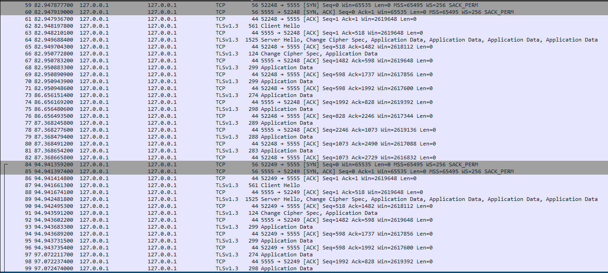
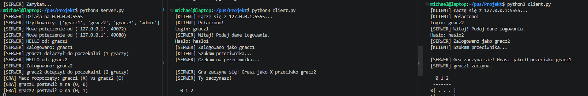
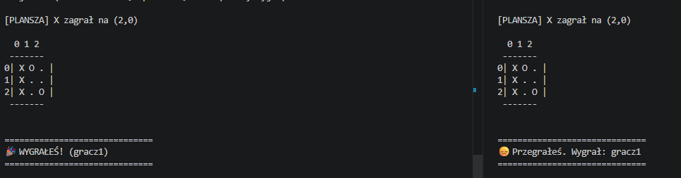
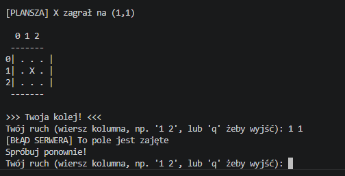
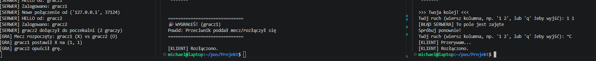
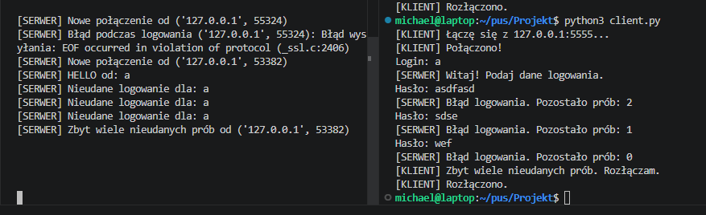
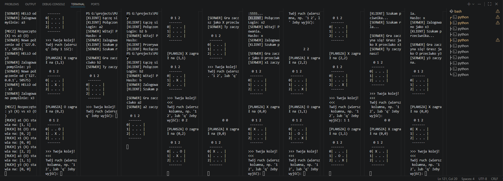

# Dokumentacja Techniczna Projektu: Aplikacja Kółko i Krzyżyk
## Etap 3 — Implementacja i Dokumentacja Uruchomienia

**Protokół:** TicTacToe Protocol

**Data:** Kwiecień 2026


**Autorzy:**
* Michał Antosiewicz (151401)
* Michał Ciesielczyk (151412)

---

## 1. Wstęp i Podsumowanie Implementacji

Aplikacja została zaimplementowana w języku Python, zgodnie ze specyfikacją protokołu TKTP opracowaną w Etapie 1 i 2. System realizuje bezpieczną, wielowątkową rozgrywkę w kółko i krzyżyk w architekturze klient-serwer.

### Kluczowe cechy implementacji:
* **Komunikacja:** Gniazda TCP owinięte w warstwę SSL/TLS.
* **Bezpieczeństwo:** Szyfrowanie kanału, podpisy HMAC-SHA256 dla każdej wiadomości, hashowanie haseł SHA-256.
* **Wielodostępność:** Serwer obsługuje wielu graczy jednocześnie (threading + matchmaking).
* **Odporność:** Obsługa nagłych rozłączeń, timeoutów oraz walidacja integralności danych.

---

## 2. Dokumentacja Uruchomienia

### 2.1 Wymagania środowiskowe
* **Interpreter:** Python 
* **Biblioteki:** Projekt korzysta wyłącznie z bibliotek standardowych (`ssl`, `socket`, `hmac`, `hashlib`, `threading`, `json`). Nie jest wymagana instalacja dodatkowych pakietów.
* **System operacyjny:** Linux, macOS lub Windows (z zainstalowanym OpenSSL dla generowania kluczy).

### 2.2 Struktura plików
```text
Projekt/
├── server.py        # Logika serwera i silnik gry
├── client.py        # Aplikacja klienta (CLI)
├── protocol.py      # Wspólna biblioteka protokołu i bezpieczeństwa
├── server.crt       # Certyfikat publiczny (generowany)
├── server.key       # Klucz prywatny serwera (generowany)
└── skrypt.txt       # Skrypt do generowania kluczy 
```

## 2.3 Generowanie certyfikatów SSL

Z uwagi na bezpieczeństwo, klucze nie są częścią repozytorium. Należy je wygenerować przed pierwszym uruchomieniem komendą:

```bash
openssl req -x509 -newkey rsa:2048 -keyout server.key -out server.crt -days 365 -nodes -subj "/CN=localhost"
```

---

## 2.4 Instrukcja startu

**Uruchomienie serwera:**

```bash
python server.py
```

Serwer domyślnie nasłuchuje na `localhost:5555`.

**Uruchomienie klientów (w osobnych terminalach):**

```bash
python client.py
```

---

## 3. Realizacja wymogów technicznych

### 3.1 Bezpieczeństwo w praktyce

**TLS (Warstwa Transportowa):**
Zastosowano ssl.create_default_context na serwerze z załadowaniem certyfikatów. Klient używa ssl.CERT_NONE (dedykowane dla certyfikatów samopodpisanych w celach projektowych), co zapewnia pełną poufność przesyłanych danych. Poniższy zrzut ekranu z analizatora Wireshark potwierdza poprawne zestawienie bezpiecznego kanału komunikacji.



**Analiza zrzutu ekranu (Wireshark):**
*   **TCP Handshake (pakiety 84-86):** Widoczne klasyczne nawiązanie połączenia (SYN, SYN-ACK, ACK), co potwierdza poprawną inicjację sesji przed negocjacją szyfrowania.
*   **TLS Handshake (pakiety 87-89):** Widoczna negocjacja nowoczesnego protokołu TLS 1.3. Pakiet nr 89 (Server Hello) zawiera również instrukcję Change Cipher Spec, po której następuje przejście na komunikację szyfrowaną.
*   **Poufność danych (Application Data):** Wszystkie kolejne pakiety (np. 93-99) są oznaczone jako Application Data. Oznacza to, że ich treść (struktury JSON) jest całkowicie zaszyfrowana i nieczytelna dla postronnego obserwatora.

**HMAC (Integralność):**
Każdy pakiet JSON jest wzbogacany o pole hmac. Serwer automatycznie odrzuca wiadomości, których podpis nie zgadza się z kluczem SECRET_KEY zdefiniowanym w modułach protokołu. Mechanizm ten zapewnia integralność danych, uniemożliwiając modyfikację treści komunikatów (np. zmianę pola ruchu na planszy) przez osoby trzecie.

**Hasła (Uwierzytelnianie):**
W systemie hasła są weryfikowane przy użyciu funkcji skrótu hashlib.sha256(). W bazie danych serwera (słowniku użytkowników) nie są przechowywane hasła w formie jawnego tekstu, co stanowi kluczowe zabezpieczenie danych użytkowników w przypadku potencjalnego wycieku bazy.

---

### 3.2 Obsługa błędów i odporność

**Timeouty:**
Serwer i klient używają `socket.settimeout(30)`. Brak aktywności przez 30 sekund (np. przy awarii sieci) skutkuje zamknięciem sesji.

**Keep-alive:**
Klient co 10 sekund wysyła `MSG_PING`, co zapobiega wygaśnięciu sesji TLS i informuje serwer o aktywności.

**Walidacja wejścia:**
Każda wiadomość od klienta przechodzi przez `json.loads` w bloku `try-except`. Błędny format JSON nie powoduje awarii serwera, lecz skutkuje logiem błędu i rozłączeniem klienta.

---

## 4. Testy i weryfikacja działania

### 4.1 Testy funkcjonalne (scenariusz poprawny)

* Gracz A i B logują się poprawnie
* Serwer paruje graczy i wysyła `MSG_START`
* Rozgrywka przebiega do momentu wygranej (3 w linii)

**Wynik:**
Serwer poprawnie kończy sesję i wysyła `MSG_BYE`.





---

### 4.2 Testy scenariuszy błędnych

**Próba ruchu na zajęte pole:**
Klient otrzymuje `MSG_ERROR` i jest proszony o ponowne podanie współrzędnych. Gra toczy się dalej.



**Nagłe zamknięcie klienta (Ctrl+C):**
Serwer wychwytuje `ConnectionResetError`, usuwa gracza z listy i przyznaje wygraną przeciwnikowi.




**Błędne hasło:**
Serwer inkrementuje licznik prób i po 3 nieudanych próbach blokuje połączenie.




---

### 4.3 Krótki test obciążeniowy

Przeprowadzono symulację uruchomienia 5 równoległych instancji gry (10 klientów).

**Wynik:**
Serwer wykorzystujący `threading.Thread` zachował stabilność.



---

## 5. Znane ograniczenia i wnioski

**Ograniczenie:**
Serwer używa wątków blokujących, co przy dużej liczbie graczy może obciążyć zasoby systemowe.

**Wniosek:**
Zastosowanie TLS + HMAC znacząco zwiększa bezpieczeństwo aplikacji przy niewielkim wpływie na wydajność.


*Koniec dokumentacji Etapu 3*
