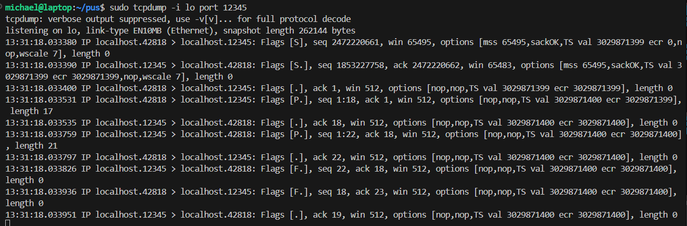
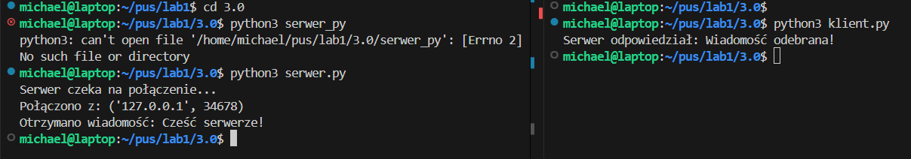
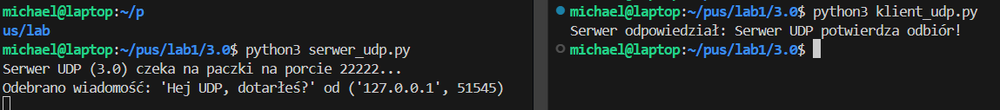
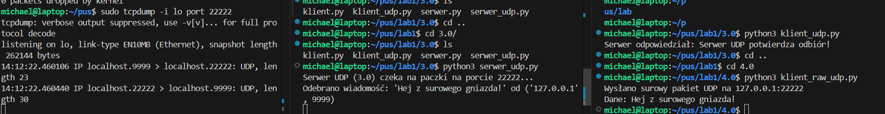
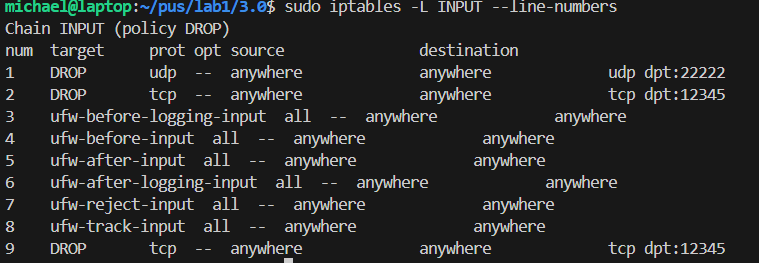

# Programowanie Usług Sieciowych — Projekt 1

## Spis treści
- [Opis projektu](#opis-projektu)
- [Wymagania](#wymagania)
- [Uruchamianie](#uruchamianie)
- [Ocena 3.0 — TCP IPv4](#ocena-30--tcp-ipv4)
- [Ocena 3.0 — UDP IPv4](#ocena-30--udp-ipv4)
- [Ocena 3.5 — IPv6](#ocena-35--ipv6)
- [Ocena 4.0 — Gniazda surowe](#ocena-40--gniazda-surowe)
- [Ocena 4.5 — Uprawnienia Linux](#ocena-45--uprawnienia-linux)
- [Ocena 5.0 — Konfiguracja firewalla](#ocena-50--konfiguracja-firewalla)

---

## Opis projektu

Projekt demonstruje programowanie komunikacji sieciowej w warstwie transportowej (TCP, UDP) i sieciowej (gniazda surowe) przy użyciu biblioteki `socket` w Pythonie. Każde zadanie to osobna para programów: klient i serwer.

---

## Wymagania

- Python 3.x
- Linux (Ubuntu) lub WSL na Windows
- tcpdump (do weryfikacji pakietów w WSL)
- Wireshark (opcjonalnie, do weryfikacji pakietów, jakby wychodzily poza WSL)

---

## Uruchamianie

Każdy program uruchamiamy w osobnym terminalu. Zawsze najpierw **serwer**, potem **klient**.

```bash
# Terminal 1
python3 nazwa_serwera.py

# Terminal 2
python3 nazwa_klienta.py
```

Gniazda surowe i porty poniżej 1024 wymagają uprawnień — patrz sekcje 4.0 i 4.5.

---

## Ocena 3.0 — TCP IPv4

**Pliki:** `serwer.py`, `klient.py`

### Co to jest TCP?

TCP (Transmission Control Protocol) to protokół warstwy transportowej (warstwa 4). Zapewnia niezawodną, dwukierunkową komunikację między klientem a serwerem. Przed wysłaniem danych TCP wykonuje **three-way handshake** — wymianę trzech pakietów (SYN → SYN-ACK → ACK) która ustanawia połączenie.

### Jak działa?

1. Serwer tworzy gniazdo `SOCK_STREAM` (TCP) na adresie `127.0.0.1` port `12345`
2. Serwer wywołuje `bind()` — rezerwuje port w systemie operacyjnym
3. Serwer wywołuje `listen()` — zaczyna nasłuchiwać
4. Serwer blokuje się na `accept()` — czeka na połączenie
5. Klient tworzy gniazdo i wywołuje `connect()` — TCP wykonuje handshake
6. `accept()` odblokowuje się i zwraca **nowe gniazdo** `client_conn` dedykowane tej sesji
7. Klient wysyła dane przez `send()`, serwer odbiera przez `recv()`
8. TCP gwarantuje że dane dotrą w całości i w odpowiedniej kolejności
9. Oba gniazda zamykane są przez `close()`

###  `accept()` 

Oryginalne gniazdo serwera (`server_socket`) służy wyłącznie do przyjmowania połączeń — jak drzwi wejściowe. Nowe gniazdo (`client_conn`) to dedykowany kanał komunikacji z konkretnym klientem. Dzięki temu serwer może obsługiwać wielu klientów jednocześnie.

### Parametry gniazda

```python
socket.socket(socket.AF_INET, socket.SOCK_STREAM)
# AF_INET     = rodzina adresów IPv4
# SOCK_STREAM = protokół TCP (niezawodny, połączeniowy)
```

### Uruchomienie

```bash
# Terminal 1
python3 serwer.py

# Terminal 2
python3 klient.py
```


### Działanie
sudo tcpdump -i lo port 12345




### Co widać w tcpdump — opis 

#### 1. Nawiązywanie połączenia (Three-Way Handshake)

Pierwsze trzy linie to "przywitanie" się klienta z serwerem:

- **Linia 1 (`[S]`):** Klient (port 42818) wysyła prośbę o połączenie (SYN) do serwera (port 12345).
- **Linia 2 (`[S.]`):** Serwer odpowiada, że jest gotowy (SYN-ACK).
- **Linia 3 (`[.]`):** Klient potwierdza otrzymanie zgody (ACK). Połączenie jest otwarte.

#### 2. Wymiana danych

Następne linie pokazują faktyczne przesyłanie informacji:

- **Linia 4 (`[P.]`):** Klient wysyła 17 bajtów danych (`length 17`). Flaga `P` (Push) mówi systemowi, aby natychmiast przekazał te dane do aplikacji.
- **Linia 6 (`[P.]`):** Serwer odpowiada, przesyłając 21 bajtów danych (`length 21`).
- **Pozostałe kropki `[.]`** to potwierdzenia (ACK), że obie strony otrzymały dane bez błędów.

#### 3. Zamykanie połączenia (Connection Termination)

Ostatnie linie to procedura "pożegnania":

- **Linie 8 i 9 (`[F.]`):** Obie strony wysyłają flagę `F` (FIN), co oznacza: "Skończyłem nadawać, możemy zamknąć połączenie".
- **Ostatnia linia** to ostateczne potwierdzenie zamknięcia sesji.

### Wynik


---

## Ocena 3.0 — UDP IPv4

**Pliki:** `serwer_udp.py`, `klient_udp.py`

### Co to jest UDP?

UDP (User Datagram Protocol) to protokół warstwy transportowej (warstwa 4). W przeciwieństwie do TCP jest **bezpołączeniowy** — nie wykonuje handshake, nie potwierdza dostarczenia danych. Jest szybszy, ale nie gwarantuje że pakiet dotrze lub że dotrze we właściwej kolejności.

### Jak działa?

1. Serwer tworzy gniazdo `SOCK_DGRAM` (UDP) i wywołuje `bind()` na porcie `22222`
2. Serwer czeka na dane w pętli `while True` — może obsługiwać wielu klientów bez tworzenia nowych gniazd
3. Klient tworzy gniazdo i od razu wysyła dane przez `sendto()` — **bez `connect()`**
4. Serwer odbiera dane przez `recvfrom()` które zwraca dane **i adres nadawcy**
5. Serwer odpowiada przez `sendto()` podając adres klienta

###  `recvfrom()` a  `recv()`

Przy TCP adres klienta był znany bo istniało stałe połączenie. Przy UDP nie ma połączenia — każdy pakiet może przyjść od kogoś innego. `recvfrom()` zwraca dane razem z adresem nadawcy żeby serwer wiedział komu odpowiedzieć.

### Parametry gniazda

```python
socket.socket(socket.AF_INET, socket.SOCK_DGRAM)
# AF_INET    = rodzina adresów IPv4
# SOCK_DGRAM = protokół UDP (szybki, bezpołączeniowy)
```

### Uruchomienie

```bash
# Terminal 1
python3 serwer_udp.py

# Terminal 2
python3 klient_udp.py
```

### Wynik



### Co widać w tcpdump — opis 

Output tcpdump dla UDP:
```
14:07:08  localhost.51545 > localhost.22222: UDP, length 20
14:07:08  localhost.22222 > localhost.51545: UDP, length 30
```

Tylko dwie linie — to kluczowa różnica względem TCP:

- **Brak handshake'a** — nie ma pakietów `[S]`, `[S.]`, `[.]` przed danymi.
  Klient nie pyta czy serwer jest gotowy — po prostu wysyła.
- **Linia 1:** Klient (port 51545, losowy) wysyła 20 bajtów do serwera
  (port 22222). To treść wiadomości `"Hej UDP, dotarłeś?"`.
- **Linia 2:** Serwer odpowiada 30 bajtami — `"Serwer UDP potwierdza odbiór!"`.
- **Brak zamknięcia połączenia** — nie ma `[F.]` na końcu.
  UDP nie ma pojęcia "połączenie" — każdy pakiet to osobna, niezależna paczka.
---

## Ocena 3.5 — IPv6

**Pliki:** `serwer_v6_tcp.py`, `klient_v6_tcp.py`

### Co to jest IPv6?

IPv6 to nowa wersja protokołu IP (warstwa sieciowa, warstwa 3). Powstał ponieważ IPv4 używa adresów 32-bitowych co daje tylko ~4 miliardy unikalnych adresów — za mało dla współczesnego internetu. IPv6 używa adresów 128-bitowych co daje 340 sekstylionów adresów.

| | IPv4 | IPv6 |
|---|---|---|
| Długość adresu | 32 bity | 128 bitów |
| Przykładowy adres | `192.168.1.1` | `2001:db8::1` |
| Loopback | `127.0.0.1` | `::1` |
| Wszystkie interfejsy | `0.0.0.0` | `::` |

### Jak działa?

Kod jest identyczny z TCP IPv4 — zmienione są tylko dwa elementy:

```python
# IPv4
socket.socket(socket.AF_INET, socket.SOCK_STREAM)
server.bind(('127.0.0.1', 12345))

# IPv6
socket.socket(socket.AF_INET6, socket.SOCK_STREAM)
server.bind(('::1', 12345))
```

TCP działa identycznie niezależnie od wersji IP — IPv6 to tylko warstwa sieciowa (3), TCP to warstwa transportowa (4). Warstwy są niezależne.

### Uruchomienie

```bash
# Terminal 1
python3 serwer_v6_tcp.py

# Terminal 2
python3 klient_v6_tcp.py
```

---

## Ocena 4.0 — Gniazda surowe

**Pliki:** `klient_raw_udp.py` (klient), serwer z oceny 3.0 (`serwer_udp.py`)

### Co to jest gniazdo surowe?

Przy zwykłych gniazdach (`SOCK_DGRAM`, `SOCK_STREAM`) system operacyjny automatycznie buduje nagłówki pakietów. Przy surowym gnieździe (`SOCK_RAW`) programista buduje nagłówki ręcznie — ma pełną kontrolę nad zawartością pakietu na poziomie warstwy sieciowej (warstwa 3).

### Co budujemy ręcznie?

Każdy pakiet UDP składa się z trzech warstw:

```
[ Nagłówek IP (20 bajtów) | Nagłówek UDP (8 bajtów) | Dane ]
     budujemy ręcznie          budujemy ręcznie        "Hej!"
```

Przy `SOCK_DGRAM` (ocena 3.0) system budował oba nagłówki automatycznie. Tutaj robimy to sami przez `struct.pack()`.

### Jak działa `struct.pack()`?

`struct.pack()` zamienia liczby na surowe bajty w formacie sieciowym:

```python
struct.pack('!BBHHHBBH4s4s', ...)
# !  = kolejność bajtów sieciowa (big-endian)
# B  = 1 bajt (liczba 0-255)
# H  = 2 bajty (liczba 0-65535)
# 4s = 4 bajty (string bajtowy, np. adres IP)
```

### Dlaczego checksum liczymy dwa razy?

Checksum zależy od zawartości nagłówka, ale sam jest polem w nagłówku — klasyczny problem jajka i kury. Rozwiązanie:

```
Krok 1: spakuj nagłówek z checksum = 0
Krok 2: oblicz checksum z tych bajtów
Krok 3: spakuj nagłówek jeszcze raz z prawdziwym checksum
```

### Dlaczego `IP_HDRINCL`?

```python
s.setsockopt(socket.IPPROTO_IP, socket.IP_HDRINCL, 1)
```

Bez tej opcji system dodałby swój własny nagłówek IP na wierzch naszego — pakiet miałby podwójny nagłówek IP i serwer by go odrzucił. `IP_HDRINCL` mówi systemowi: *"nagłówek IP dostarczam sam, nie dodawaj swojego"*.

### Test poprawności

Jeśli zwykły serwer UDP z oceny 3.0 odbierze pakiet od surowego klienta, oznacza to że nagłówek UDP został zbudowany poprawnie.

### Uruchomienie

```bash
# Nadanie uprawnień (jednorazowo)
sudo setcap 'cap_net_raw+ep' $(which python3)

# Terminal 1 — zwykły serwer UDP z oceny 3.0
python3 serwer_udp.py

# Terminal 2 — surowy klient
python3 klient_raw_udp.py
```

### Wynik

---

## Ocena 4.5 — Uprawnienia Linux

### Problem

Porty poniżej 1024 są zarezerwowane dla systemu. Próba ich użycia bez uprawnień kończy się błędem:

```
chael@laptop:~/pus/lab1/4.5$ python3 serwer_1024.py 
[BŁĄD] Brak uprawnień do portu 80!
Nadaj uprawnienia komendą:
  sudo setcap 'cap_net_raw,cap_net_bind_service+ep' $(which python3)
```

### Złe rozwiązanie — `sudo`

```bash
sudo python3 serwer.py   # daje WSZYSTKIE uprawnienia roota całemu programowi
```

To niebezpieczne — jeśli program ma błąd, atakujący może przejąć kontrolę nad całym systemem.

### Dobre rozwiązanie — Linux Capabilities

Mechanizm `capabilities` pozwala nadać programowi tylko konkretne uprawnienia zamiast pełnych uprawnień roota. Zasada najmniejszych uprawnień.

```bash
sudo setcap 'cap_net_raw,cap_net_bind_service+ep' $(which python3.12)

```

Co oznaczają poszczególne części:

| Część | Znaczenie |
|---|---|
| `cap_net_raw` | może tworzyć surowe gniazda |
| `cap_net_bind_service` | może bindować porty poniżej 1024 |
| `+ep` | effective + permitted (uprawnienie aktywne) |
| `$(which python3)` | ścieżka do interpretera Pythona |

### Weryfikacja
'
michael@laptop:~/pus/lab1/4.5$ python3 serwer_1024.py 
Serwer działa na porcie 80 bez uprawnień roota!
Czekam na wiadomości...
'
### Cofnięcie uprawnień

```bash
sudo setcap -r $(which python3)
```

---

## Ocena 5.0 — Konfiguracja firewalla

### Narzędzie: `iptables`

Linux posiada wbudowany firewall `iptables` który filtruje ruch sieciowy na poziomie jądra systemu.

### Ważne — kolejność reguł ma znaczenie

iptables sprawdza reguły **od góry do dołu** i zatrzymuje się na pierwszej pasującej. Dlatego przy blokowaniu zawsze używamy `-I INPUT 1` (wstaw na pierwszą pozycję), nie `-A` (dodaj na końcu).
```
Reguła 1: DROP port 12345  ← sprawdzana pierwsza, pasuje = blokuj
Reguła 2: ACCEPT wszystko  ← nigdy nie zostanie sprawdzona jeśli pasuje reguła 1
```

Gdyby reguła DROP była na końcu, reguła ACCEPT przepuściłaby pakiet zanim doszłoby do blokowania.

### Blokowanie ruchu
```bash
# Zablokuj TCP na porcie 12345 (wstaw jako pierwsza reguła)
sudo iptables -I INPUT 1 -p tcp --dport 12345 -j DROP

# Zablokuj TCP na porcie 12345 tylko na loopbacku
sudo iptables -I INPUT 1 -i lo -p tcp --dport 12345 -j DROP

# Zablokuj UDP na porcie 22222
sudo iptables -I INPUT 1 -p udp --dport 22222 -j DROP

# Zablokuj tcp z ip6
sudo ip6tables -I INPUT 1 -p tcp --dport 12345 -j DROP
```

### Odblokowanie ruchu
```bash
# Usuń pierwszą regułę INPUT
sudo iptables -D INPUT 1

# Usuń konkretną regułę (identyczna składnia jak przy dodawaniu, -D zamiast -I)
sudo iptables -D INPUT -p tcp --dport 12345 -j DROP
```

### Wyświetlenie aktualnych reguł
```bash
sudo iptables -L INPUT --line-numbers   #dla ip4

sudo ip6tables -L INPUT -n --line-numbers #dla ip6
```



dwie pierwsze blokuja tcp oraz udp

### Czyszczenie wszystkich reguł
```bash
sudo iptables -F
```

> **Uwaga:** `iptables -F` usuwa WSZYSTKIE reguły — wywala wsl - potrzebny restart systemu.


## Podsumowanie plików

| Plik | Ocena | Opis |
|---|---|---|
| `serwer.py` | 3.0 | Serwer TCP IPv4 |
| `klient.py` | 3.0 | Klient TCP IPv4 |
| `serwer_udp.py` | 3.0 | Serwer UDP IPv4 |
| `klient_udp.py` | 3.0 | Klient UDP IPv4 |
| `serwer_v6_tcp.py` | 3.5 | Serwer TCP IPv6 |
| `klient_v6_tcp.py` | 3.5 | Klient TCP IPv6 |
| `klient_raw_udp.py` | 4.0 | Klient z surowym gniazdem UDP |